Author: Pedro Henrique de Avila Tonin

# First Challenge

In this document, I am going to describe the project and showcase all the features that I have added.

The blog is fully responsive. It can be viewed in both mobile and desktop versions with complete accessibility.

First, I am going to show the mobile version.
## Mobile

### Front page
#### Top of the front page

#### Top of the front page with the menu open
 \
This menu is a responsive feature. When the screen is large enough, the menu button disappears, and the options stay fixed in the navbar.

#### Body of the front page

 \
In the images, you can see the pagination in action. Pagination is a feature that I added so users can navigate between the available pages more effectively.
Furthermore, I've added an advertisement to be displayed differently on larger screens.

#### Footer of the front page

### Articles pages
#### Top of the article page

#### Top of the article page with the menu open

#### Body of the article page

#### Comments section
 \
The comment section is filled with dummy data, fetched using the API [dummyJSON](https://dummyjson.com/).
In addition, I've included input fields that allow users to add their own comments. When the user selects the "SEND" button or presses "Enter" while the input text box is selected, the comment is added to the section.
The image below shows the section as it was before, with a new comment added.

#### "What to read next" section
 \
This section holds three other articles that users can navigate by simply clicking on any of them.

#### Newsletter and footer of the article page

## Desktop

### Front page

#### Top of the front page
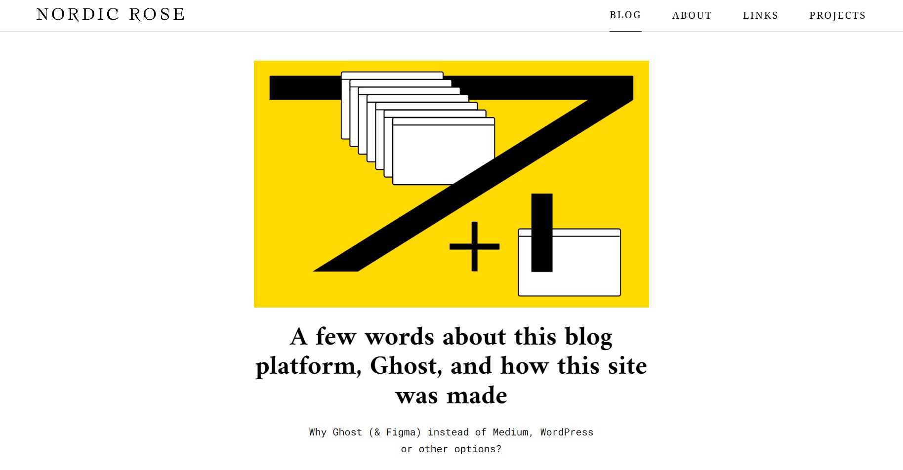

#### All articles section of the front page
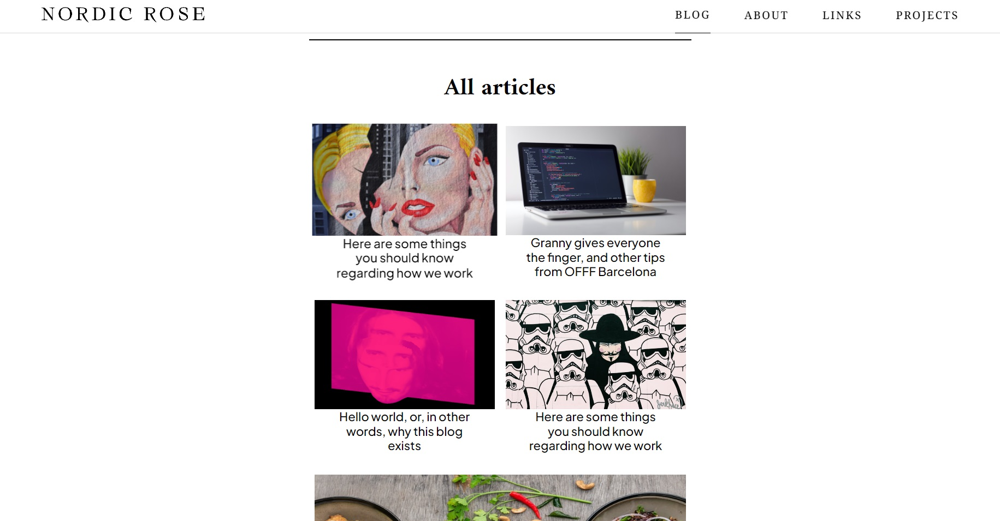

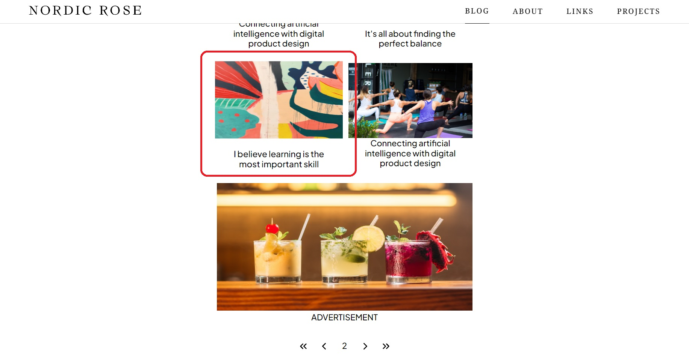 \
In the images, you can see the pagination and an awesome hover effect in action.

Furthermore, it is possible to see the different display of the advertisement, as mentioned before.

#### Footer of the front page

### Articles pages

#### Top of the article page

#### Body of the article page
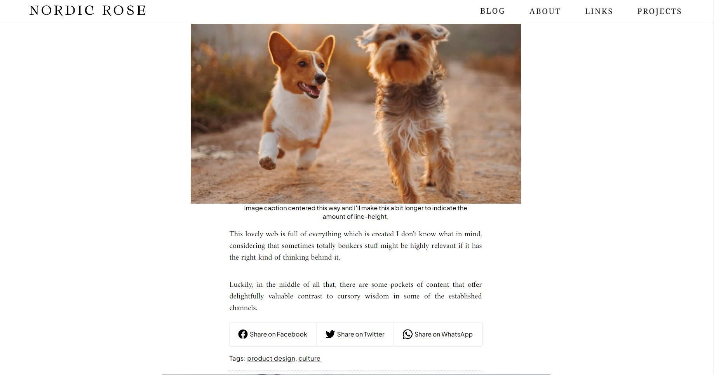

#### Comments section
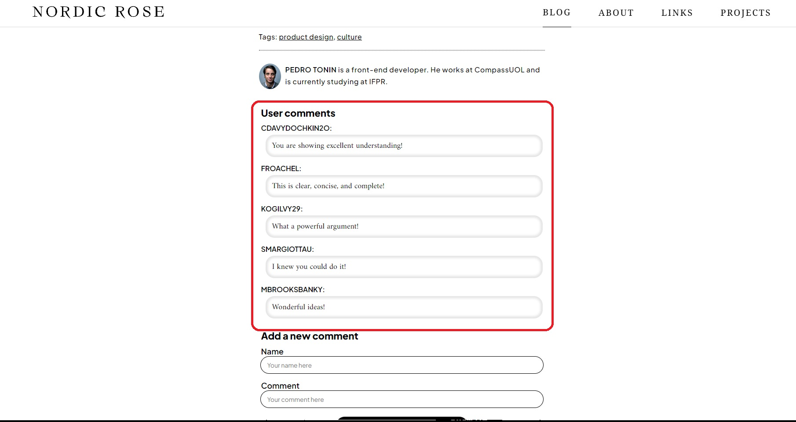
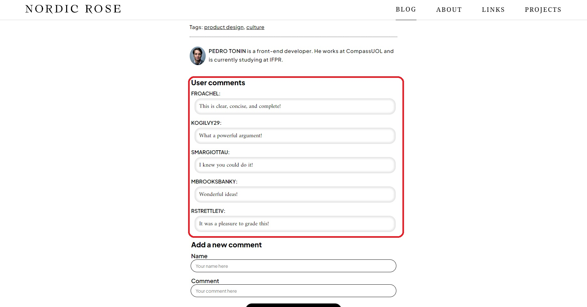 \
Just like the mobile version, the comment section is filled with dummy data, fetched using the API [dummyJSON](https://dummyjson.com/).
In the images above, it's possible to see the comments updating every time we refresh the page.

In addition, I've included input fields that allow users to add their own comments. When the user selects the "SEND" button or presses "Enter" while the input text box is selected, the comment is added to the section.

The image below shows the section as it was before, with a new comment added.
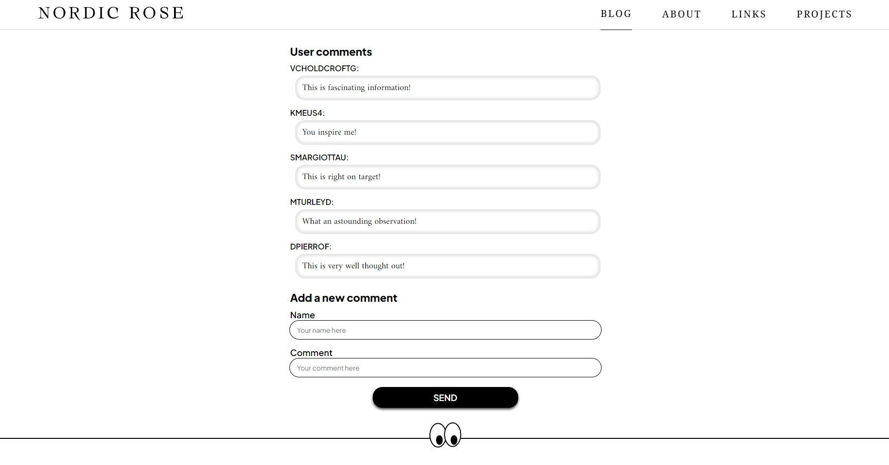
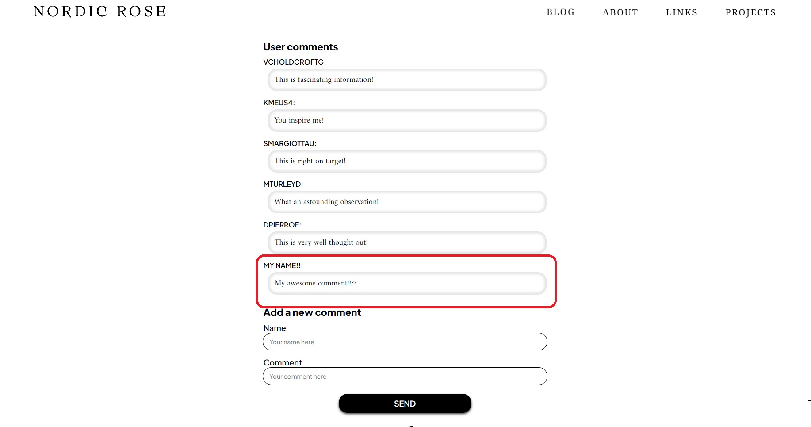

#### "What to read next" section
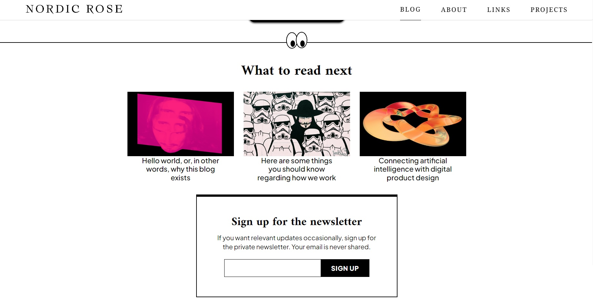 
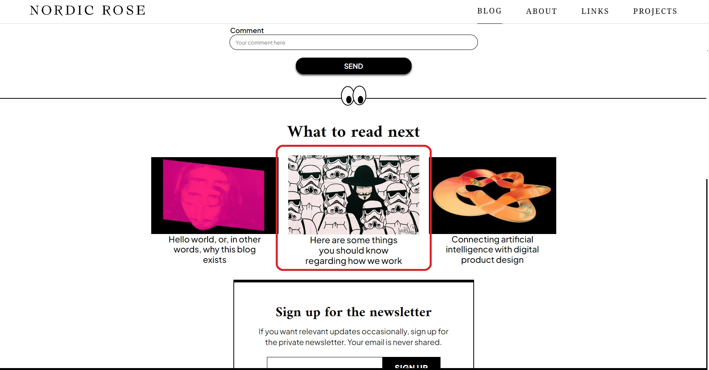 \
This section holds three other articles that users can navigate by simply clicking on any of them.
In the desktop version, it's displayed differently to improve user experience and has an awesome hover effect :D.

#### Newsletter and footer
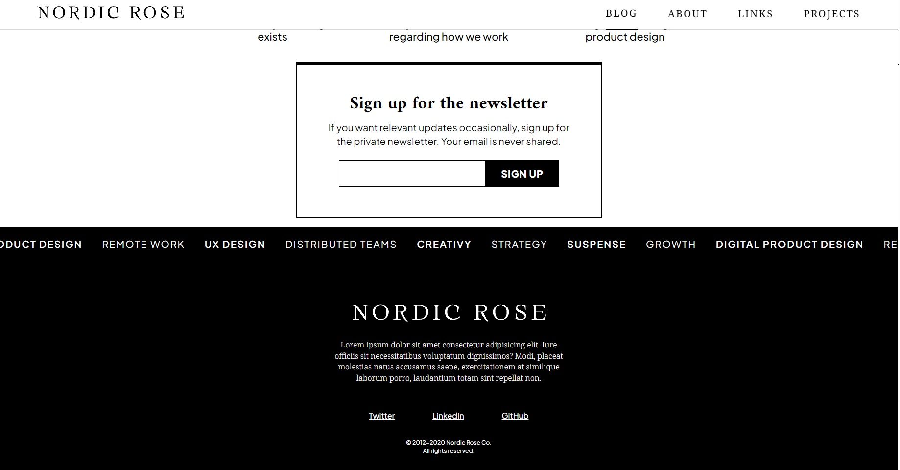
